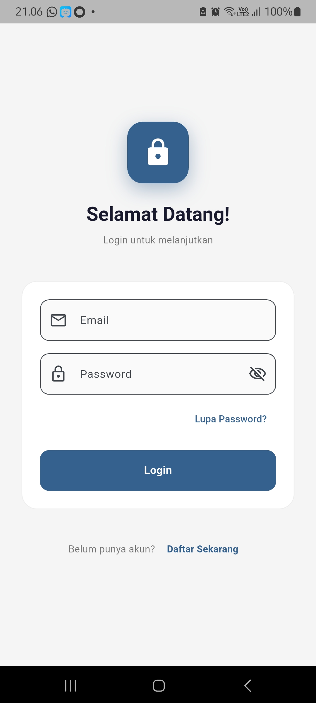
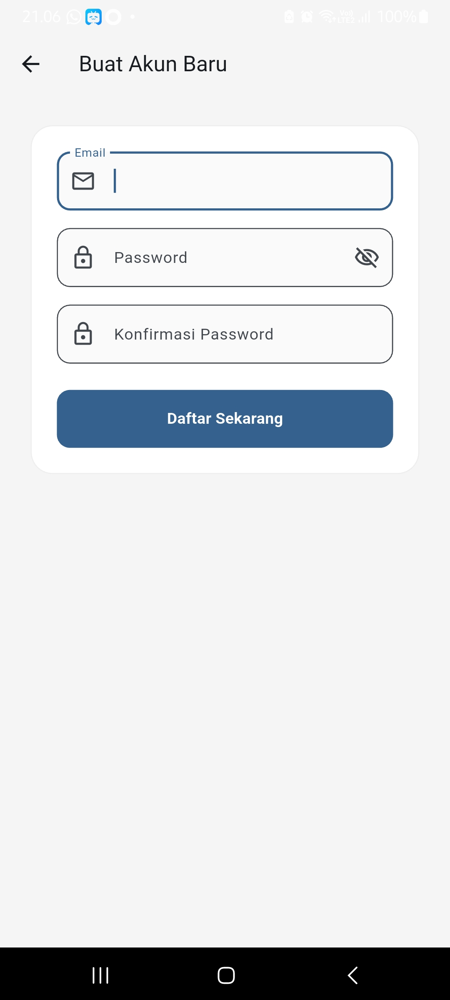
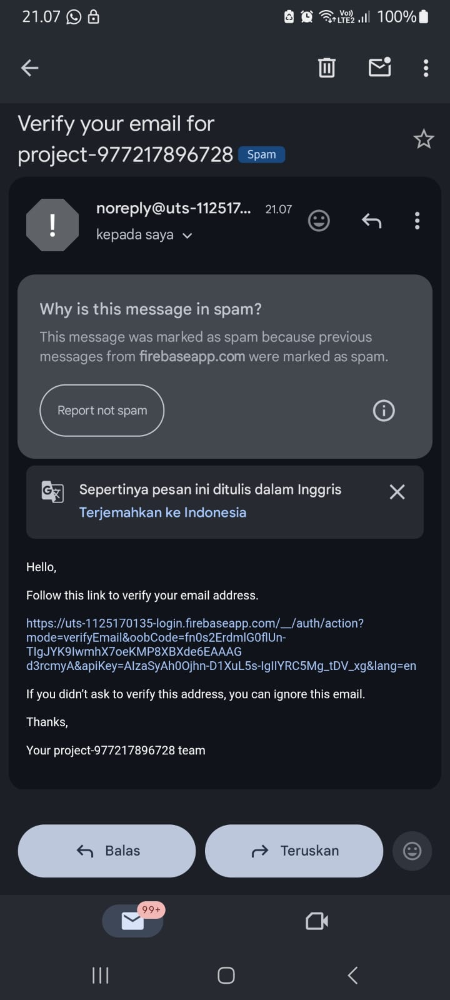
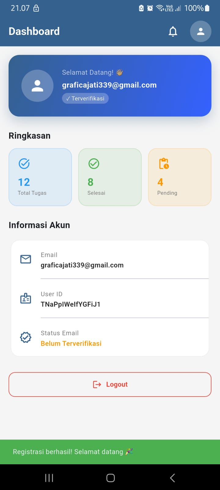
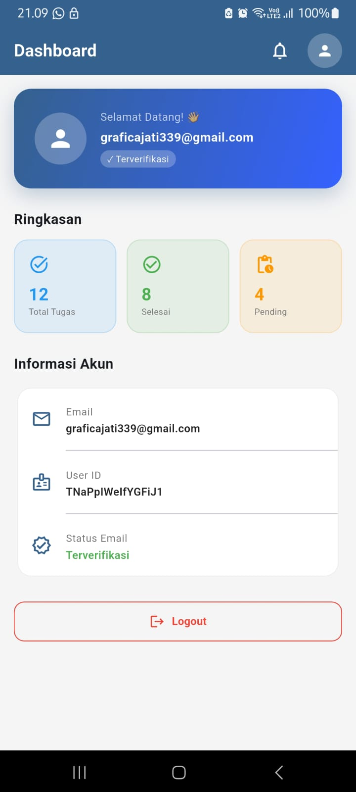

# UTS Pemrograman Mobile Lanjutan
## 📱 Aplikasi
**Aplikasi Stok Barang KominfotikJb**

## 👨‍💻 Pengembang
### Grafica Jati Sugiyarto  
**NIM:** 1125170135  
**Kelas:** TI SE KS 25  
**Program Studi:** Teknik Informatika  
**Konsentrasi:** Software Engineering  

---

## ⚙️ Tech Stack
Aplikasi ini dirancang menggunakan:

- **Flutter**  
  Sebagai Front-End untuk menerima respon dari backend dan mengirim input dari user.

- **Firebase**  
  Digunakan untuk autentikasi, termasuk verifikasi email dan login dengan Google.

- **Golang (Backend API)**  
  Sebagai backend untuk menghubungkan database dengan aplikasi frontend.

- **MySQL**  
  Sebagai database lokal untuk penyimpanan data.

---

## 📌 Deskripsi Singkat

---
### 🔐 Login

Halaman login pengguna dengan form email dan password.

### 📝 Register

Halaman pendaftaran akun baru dengan input data pengguna.

### ✉️ Verifikasi Email

Menampilkan proses verifikasi email setelah registrasi.

### 💬 Dashboard belum verifikasi

Menampilkan tampilan pengiriman email atau notifikasi dari sistem.

### 🏠 Dashboard sudah verifikasi

Menampilkan daftar produk dan kategori utama.
